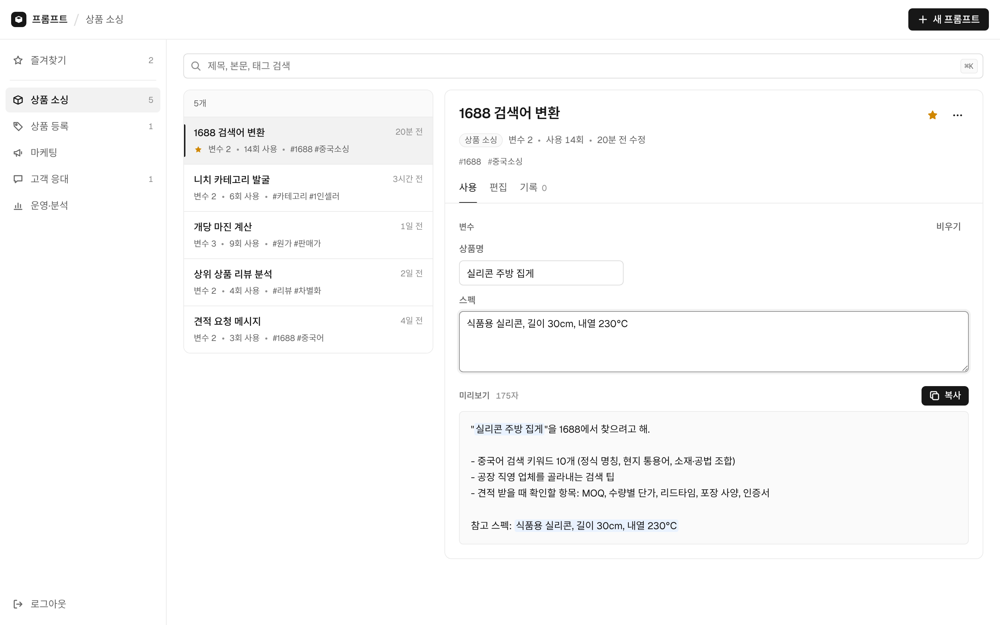
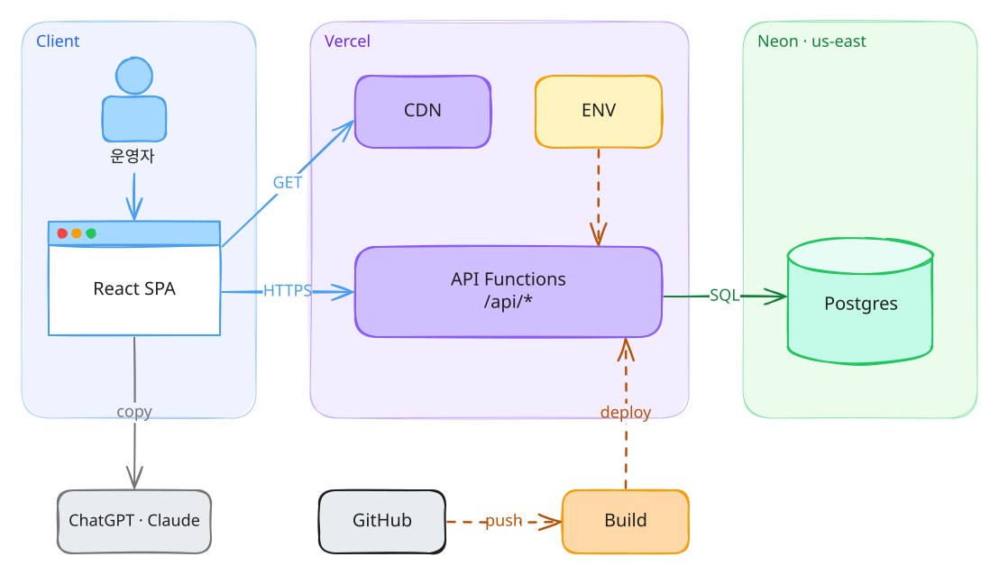
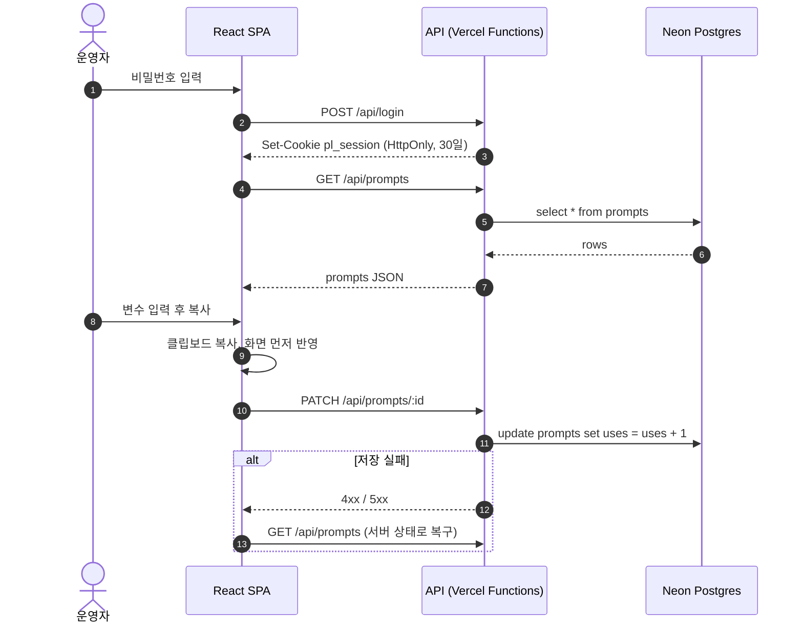
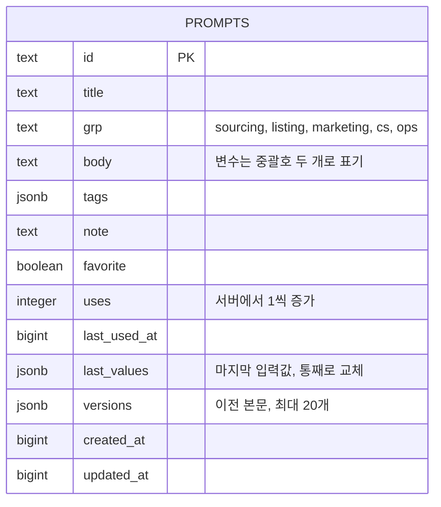

# 프롬프트 — 스마트스토어 운영용 프롬프트 관리 앱

네이버 스마트스토어를 혼자 운영하며 반복해서 쓰는 AI 프롬프트를 업무 단계별로 모아두고, 바뀌는 부분만 채워 바로 복사해 쓰는 개인용 웹 앱입니다.

**배포**: [side-e-commerce-prompt-management.vercel.app](https://side-e-commerce-prompt-management.vercel.app) (비밀번호 로그인)


<picture>
  <source media="(prefers-color-scheme: dark)" srcset="docs/screenshot-dark.png">
  
</picture>

## 왜 만들었나

상품 소싱, 상세페이지 문구, 리뷰 답글처럼 매번 비슷한 프롬프트를 쓰는데, 메모장에 흩어져 있어 찾기 어렵고 상품명 같은 부분을 매번 손으로 고쳐야 했습니다. 프롬프트를 템플릿으로 저장하고 `{{변수}}`만 채우면 완성본이 나오도록 만들었습니다.

## 주요 기능

- **업무 단계별 분류**: 상품 소싱 · 상품 등록 · 마케팅 · 고객 응대 · 운영·분석, 그리고 즐겨찾기
- **변수 템플릿**: 본문의 `{{상품명}}`을 자동으로 인식해 입력 칸을 만들고, 미리보기를 거쳐 한 번에 복사합니다. 마지막 입력값과 사용 횟수가 남습니다.
- **수정 기록**: 본문을 고칠 때마다 이전 버전을 20개까지 보관하고 되돌릴 수 있습니다.
- **검색과 태그**: 제목·본문·태그 검색, 태그를 누르면 같은 태그만 모아 봅니다.
- **비밀번호 로그인**: 혼자 쓰는 앱이라 회원가입 없이 단일 비밀번호로 보호합니다.


## 아키텍처

<picture>
  <source media="(prefers-color-scheme: dark)" srcset="docs/architecture-dark.svg">
  
</picture>

- 화면은 Vercel CDN이 내려주는 React SPA이고, 데이터는 같은 프로젝트의 서버리스 함수(`/api/*`)를 거쳐 Neon Postgres에 저장됩니다.
- 비밀번호와 DB 주소는 Vercel 환경변수로만 주입하며 코드에는 들어가지 않습니다.
- `main`에 푸시하면 Vercel이 화면과 API를 함께 다시 배포합니다.

원본은 [`docs/architecture.excalidraw`](docs/architecture.excalidraw)이며 [excalidraw.com](https://excalidraw.com)에서 열어 수정할 수 있습니다.

## 요청 흐름



## 기술 선택과 이유

| 영역 | 선택 | 이유 | 고려한 대안 |
|---|---|---|---|
| 화면 | React 18 + Vite | 상태가 많은 단일 화면 앱이라 컴포넌트 단위로 나누기 좋고, 빌드가 빠름 | Next.js: 서버 렌더링이 필요 없는 로그인 뒤 개인 도구라 제외 |
| API | Vercel Functions | 화면과 같은 레포·같은 배포로 관리, 서버 운영 부담 없음 | 별도 Express 서버: 1인 도구에 비해 운영 비용이 큼 |
| DB | Neon Postgres | Vercel에서 바로 연결되는 무료 플랜, HTTP 기반 서버리스 드라이버 | 브라우저 저장(localStorage): 기기 간 동기화가 안 됨 |
| 인증 | 단일 비밀번호 + HMAC 서명 쿠키 | 사용자 한 명이라 회원 테이블이 필요 없음. 비밀번호를 바꾸면 모든 세션이 무효화됨 | OAuth, Neon Auth: 이 규모에선 과함 |
| 테스트 | node:test · Playwright · PGlite | 실제 Postgres(메모리 내)로 API와 화면을 끝까지 검증 | Docker Postgres: 로컬·CI 준비가 무거움 |

## 데이터 모델



테이블은 첫 요청 때 자동으로 만들어지므로 따로 마이그레이션할 필요가 없습니다.

## 문제 해결 기록

**비운 변수가 다시 살아나는 문제**
프로토타입에서 쓰던 저장소는 부분 수정 시 중첩 객체를 합치는 방식이라, 변수 입력값을 비우고 저장해도 이전 키가 남았습니다. 정식 API는 `lastValues` 같은 필드를 받으면 통째로 교체하도록 설계했고, 같은 상황을 API 테스트와 E2E 테스트로 고정했습니다.

**사용 횟수가 누락될 수 있는 구조**
처음엔 화면이 `uses + 1`을 계산해 보냈는데, 여러 탭에서 동시에 복사하면 한쪽이 덮어써집니다. 화면은 `incrementUses`만 보내고 증가는 SQL(`uses = uses + 1`)에서 하도록 바꿨습니다.

**DB 리전을 한국이 아닌 미국 동부로 둔 이유**
사용자는 한국에 있지만, 실제로 DB와 통신하는 쪽은 Vercel 함수이고 그 기본 실행 리전이 미국 동부입니다. 한 요청 안에서 함수와 DB가 여러 번 오가므로 DB를 함수와 같은 Washington D.C. 리전에 두는 편이 전체 응답이 빠릅니다.

**저장 실패 시 화면과 서버가 어긋나는 문제**
즐겨찾기나 수정은 화면에 먼저 반영하고 서버에 저장합니다(낙관적 업데이트). 저장이 실패하면 오류를 알리고 서버 목록을 다시 불러와 화면을 실제 상태로 되돌립니다. E2E 테스트에서 500 응답을 일부러 주입해 확인합니다.

**편집 중 이동하면 내용이 사라지는 문제**
편집 중에 다른 프롬프트나 카테고리를 누르면 "계속 편집 / 버리고 이동" 확인창을 띄웁니다. 새 프롬프트 모달도 Esc나 바깥 클릭으로 닫으면 작성 중인 내용을 기억합니다.

## 테스트

```bash
npx playwright install chromium   # 처음 한 번
npm test                          # API 11개 + 브라우저 E2E 14개
```

- `tests/api.test.js`: 로그인, 권한 없는 접근 차단, 입력 검증, 필드 교체, 사용 횟수 증가, 설정 누락 안내
- `tests/e2e/app.spec.js`: 로그인부터 추가·복사·즐겨찾기·편집 기록·카테고리 이동·태그 필터·복제·삭제·저장 실패 복구·로그아웃·모바일 화면까지 실제 사용 순서대로
- 테스트 서버(`tests/server.js`)는 배포되는 API 파일을 그대로 불러오고, DB만 메모리 내 Postgres(PGlite)로 바꿔 실행합니다.

## 프로젝트 구조

```
api/            Vercel 함수 (로그인, 프롬프트 CRUD)
server/         DB 연결, 인증, 입력 검증
src/            React 화면
tests/          API 테스트, E2E 테스트, 테스트 서버
docs/           스크린샷, 아키텍처 그림
```

## 실행과 배포

**로컬 실행**

```bash
npm install
npx vercel dev   # API까지 함께 실행. .env에 APP_PASSWORD, DATABASE_URL 필요 (.env.example 참고)
```

**Vercel 배포**

1. Vercel에서 이 레포를 Import합니다. Framework는 Vite로 자동 인식됩니다.
2. 환경변수 `APP_PASSWORD`(로그인 비밀번호)를 추가하고 배포합니다.
3. 프로젝트의 Storage에서 Neon 데이터베이스를 만들어 연결합니다. `DATABASE_URL`이 자동으로 추가됩니다.
4. 다시 배포합니다. 이후로는 `main`에 푸시할 때마다 자동 배포됩니다.
